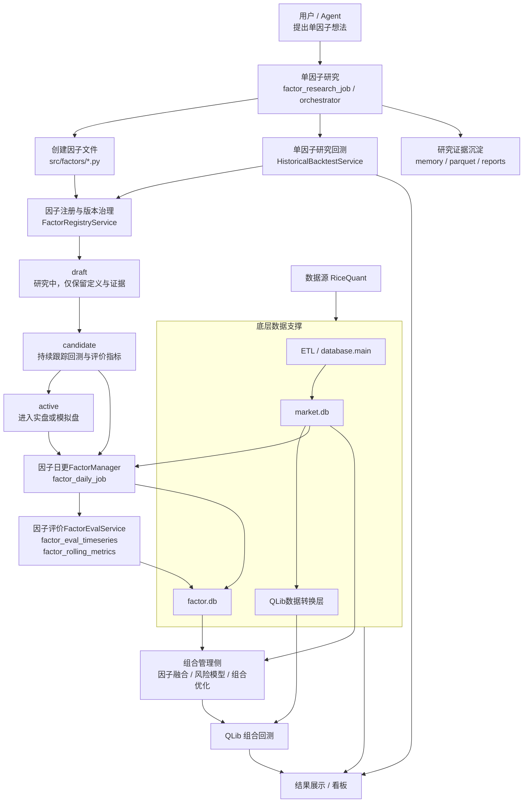

```mermaid
flowchart TD
    U["用户 / Agent<br/>提出单因子想法"] --> R["单因子研究<br/>factor_research_job / orchestrator"]
    R --> F["创建因子文件<br/>src/factors/*.py"]
    R --> B["单因子研究回测<br/>HistoricalBacktestService"]
    R --> M["研究证据沉淀<br/>memory / parquet / reports"]

    F --> G["因子注册与版本治理<br/>FactorRegistryService"]
    B --> G

    G --> D["draft<br/>研究中，仅保留定义与证据"]
    D --> C["candidate<br/>持续跟踪回测与评价指标"]
    C --> A["active<br/>进入实盘或模拟盘"]

    subgraph Support["底层数据支撑"]
        ETL["ETL / database.main"]
        MARKET["market.db"]
        FACTORDB["factor.db"]
        MARKET --> QT["QLib数据转换层"]
    end
    RICEQUANT["数据源 RiceQuant"] --> Support

    ETL --> MARKET
    MARKET --> V["因子日更FactorManager<br/>factor_daily_job"]

    C --> V
    A --> V
    V --> FACTORDB
    V --> E["因子评价FactorEvalService <br/> factor_eval_timeseries <br/>factor_rolling_metrics"]

    E --> FACTORDB
    MARKET --> P["组合管理侧<br/>因子融合 / 风险模型 / 组合优化"]
    FACTORDB --> P

    P --> Q["QLib 组合回测"]
    
    QT --> Q

    Support --> DASH
    Q --> DASH["结果展示 / 看板"]
    B --> DASH
```
